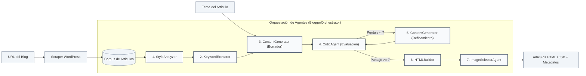

# Blogger Agent TFG

> Sistema multiagent de inteligencia artificial diseñado para la emulación estilística de blogs, incorporando visualización interactiva de flujos de trabajo (Daggr). Desarrollado bajo una arquitectura moderna basada en Next.js, Modal y Supabase.

<p align="center">
  
</p>

*Multi-agent AI system that analyzes a blogger's style, generates new articles that faithfully mimic it and publishes them end to end.*

<p align="center">
  <a href="https://blogger-agent-tfg.vercel.app"><strong>Live Demo — blogger-agent-tfg.vercel.app</strong></a>
</p>

<div align="center">
  <a href="LICENSE"></a>
  <a href="https://github.com/AlejandroRS21/blogger-agent-tfg"></a>
  <a href="https://blogger-agent-tfg.vercel.app"></a>
  <a href="https://nextjs.org"></a>
  <a href="https://react.dev"></a>
  <a href="https://www.typescriptlang.org"></a>
  <a href="https://www.python.org"></a>
  <a href="https://tailwindcss.com"></a>
  <a href="https://supabase.com"></a>
  <a href="https://modal.com"></a>
  <a href="https://huggingface.co"></a>
</div>

---

## Índice de Contenidos

- [Índice de Contenidos](#índice-de-contenidos)
- [Arquitectura y Despliegue del Sistema](#arquitectura-y-despliegue-del-sistema)
- [Descripción del Proyecto](#descripción-del-proyecto)
- [Arquitectura del Sistema](#arquitectura-del-sistema)
- [Inicio Rápido](#inicio-rápido)
  - [Backend — Orquestador Completo](#backend-orquestador-completo)
  - [Interfaz Visual Interactiva con Daggr (Recomendado)](#interfaz-visual-interactiva-con-daggr-recomendado)
  - [Pipeline Simplificado](#pipeline-simplificado)
  - [Frontend — Next.js 16](#frontend-nextjs-16)
  - [Despliegue en Vercel](#despliegue-en-vercel)
  - [Batería de Pruebas](#batería-de-pruebas)
- [Flujo de Trabajo (7 Fases)](#flujo-de-trabajo-7-fases)
  - [Diagrama del Proceso (Pipeline de Agentes)](#diagrama-del-proceso-pipeline-de-agentes)
- [Integración con la Plataforma Modal](#integración-con-la-plataforma-modal)
- [Estado del Proyecto](#estado-del-proyecto)
  - [Hitos Completados](#hitos-completados)
  - [Tareas Pendientes](#tareas-pendientes)
- [Documentación Técnica](#documentación-técnica)
- [Tecnologías Empleadas](#tecnologías-empleadas)
- [Consistencia Documental](#consistencia-documental)
- [Licencia](#licencia)
- [Contexto Académico](#contexto-académico)

---

## Arquitectura y Despliegue del Sistema

El ecosistema de la aplicación está compuesto por tres componentes principales, desplegados de la siguiente forma:

1. **Frontend (Next.js 16)**: Desplegado en **Vercel**. Consume y expone los artículos recuperándolos en tiempo real desde la base de datos de manera dinámica.
2. **Backend (Orquestador de Agentes)**: Hospedado en **Modal** como una infraestructura de funciones sin servidor (serverless). Procesa la generación de artículos bajo demanda a través de webhooks.
3. **Base de Datos (Supabase)**: Base de datos Postgres que actúa como el almacenamiento central de persistencia para todos los artículos generados por los agentes.

### Flujo de Generación y Publicación

1. **Petición del usuario**: Desde la interfaz web en Next.js (Vercel), el usuario solicita la generación de un nuevo artículo definiendo el tema y la URL del blogger de referencia.
2. **Invocación del webhook**: La aplicación Next.js invoca el webhook serverless expuesto por el backend en Modal.
3. **Ejecución del pipeline**: Modal ejecuta el orquestador multiagente (7 fases) para extraer el estilo, estructurar el borrador, aplicar la crítica/refinamiento y seleccionar recursos visuales.
4. **Persistencia automática**: Una vez completada la generación, el backend de Modal guarda el artículo formateado directamente en la base de datos de Supabase.
5. **Actualización dinámica**: El frontend de Next.js realiza consultas dinámicas (sin caché) a Supabase para mostrar de inmediato la nueva publicación en el feed.

---

## 📋 Descripción del Proyecto

Este sistema multiagente ha sido diseñado para analizar en detalle el estilo de redacción de un autor (blogger) y generar nuevos artículos de divulgación que mimetizan fielmente su tono de voz. La arquitectura y el flujo de agentes de este desarrollo están inspirados en el proyecto [Aphra](https://github.com/DavidLMS/aphra).

El backend emplea **HuggingFace** como proveedor de modelos de lenguaje principal (de acceso gratuito), **Modal** para la infraestructura sin servidor (serverless) con soporte para GPU, y **Daggr** para la visualización interactiva del flujo de trabajo de los agentes. El frontend está desarrollado con **Next.js 16**, React 19, TypeScript y Tailwind CSS 4, persistiendo todos los artículos de manera centralizada en **Supabase**.

## 🏗️ Arquitectura del Sistema

```
blogger-agent-tfg/
├── backend/                         # Python + Orquestador + Daggr
│   ├── aphra_blogger/
│   │   ├── llm/                     # Abstracción multi-provider LLM
│   │   │   ├── base.py              # Clases abstractas
│   │   │   ├── factory.py           # Factory con auto-fallback
│   │   │   ├── huggingface_provider.py  # HuggingFace (primario, gratis)
│   │   │   ├── openai_provider.py       # OpenAI (fallback)
│   │   │   ├── gemini_provider.py       # Gemini (alternativo)
│   │   │   └── modal_provider.py        # Modal con GPU (producción)
│   │   ├── agents/                  # Agentes especializados
│   │   │   ├── style_analyzer.py        # Análisis de estilo
│   │   │   ├── keyword_extractor.py     # Extracción de keywords
│   │   │   ├── content_generator.py     # Generación y refinamiento
│   │   │   ├── critic.py                # Crítica y evaluación
│   │   │   ├── image_selector.py        # Selección de imágenes
│   │   │   ├── html_builder.py          # Markdown → HTML/JSX
│   │   │   ├── anonymous_blogger.py     # Emulación de blogueros anónimos
│   │   │   └── style_extractor.py       # Extracción legacy de estilo
│   │   ├── workflows/
│   │   │   └── blogger_style.py
│   │   ├── config/
│   │   │   └── default.toml
│   │   └── context.py
│   ├── src/
│   │   └── orchestrator/            # Sistema de orquestación
│   │       ├── main.py              # Orquestador (7 fases)
│   │       ├── config.py
│   │       ├── state.py
│   │       └── runner.py            # CLI
│   ├── tools/
│   │   └── scraper.py               # Web scraper WordPress
│   ├── tests/                       # ~80 tests
│   │   ├── test_agents.py
│   │   ├── test_orchestrator.py
│   │   ├── test_html_builder.py
│   │   ├── test_scraper.py
│   │   ├── test_workflow.py
│   │   └── test_anonymous_blogger.py
│   ├── daggr_blogger_workflow.py    # Workflow visual con Daggr
│   ├── modal_app.py                 # Deployment Modal (serverless)
│   ├── llm_modal_host.py            # Hosting LLM propio en Modal GPU
│   ├── generate_and_deploy.py       # Pipeline simplificado
│   ├── outputs/                     # Posts generados (JSON)
│   ├── requirements.txt
│   ├── pyproject.toml
│   ├── DAGGR_WORKFLOW.md
│   └── setup.sh / setup.ps1
├── frontend/                         # Next.js 16 + React 19 + Tailwind 4
│   ├── app/
│   │   ├── layout.tsx                # Root layout
│   │   ├── page.tsx                  # Homepage
│   │   ├── globals.css
│   │   ├── generate/page.tsx         # Formulario de generación
│   │   ├── posts/[slug]/page.tsx     # Vista de post individual
│   │   └── api/generate-post/route.ts # API endpoint (mock/real)
│   ├── components/
│   │   ├── Header.tsx
│   │   ├── Footer.tsx
│   │   ├── GenerateForm.tsx          # Client component
│   │   ├── PostCard.tsx
│   │   └── PostContent.tsx
│   ├── types/post.ts
│   ├── lib/api.ts
│   ├── package.json
│   └── README.md
├── docs/                            # (Legacy) Web Estática anterior
├── project_docs/                    # Documentación técnica
│   ├── ORCHESTRATION_PLAN.md
│   ├── MODAL_DEPLOYMENT.md
│   ├── HUGGINGFACE_MIGRATION.md
│   ├── FRONTEND_IMPLEMENTATION.md   # Histórico: frontend eliminado
│   └── ...
├── LICENSE                          # MIT
└── ...
```

---

## 🚀 Inicio Rápido

### Backend — Orquestador Completo

```bash
# 1. Clonar el repositorio
git clone https://github.com/AlejandroRS21/blogger-agent-tfg.git
cd blogger-agent-tfg/backend

# 2. Configuración automatizada con el gestor UV ⚡
./setup.sh   # Linux/macOS
# o bien
.\setup.ps1  # Windows

# 3. Configurar las claves de API (gratuitas) 🆓
export HF_TOKEN="hf_..."           # HuggingFace (modelo primario, gratuito)
# Proveedores alternativos:
export GEMINI_API_KEY="..."        # Gemini (gratuito con límites de cuota)
export OPENAI_API_KEY="sk-..."     # OpenAI (de pago, contingencia/fallback)

# 4. Ejecutar el orquestador (proceso de 7 fases)
python -m src.orchestrator.runner \
  --topic "Las mejores prácticas para desarrollar APIs REST con Python" \
  --blog-url "https://javipas.com" \
  --output "post.json"
```

### Interfaz Visual Interactiva con Daggr (Recomendado) 🎨

```bash
cd backend
python daggr_blogger_workflow.py
# Abrir http://localhost:7860
```

**Funcionalidades de Daggr:**
- 📊 **Visualización del flujo de trabajo**: Lienzo interactivo que muestra las conexiones entre agentes.
- 🔍 **Inspección por nodo**: Permite examinar en detalle la entrada y salida de cada agente.
- 🔄 **Reejecución selectiva**: Capacidad para ejecutar únicamente los nodos requeridos.
- ⏱️ **Depuración visual**: Facilita la identificación de errores en cada fase del proceso.
- 💾 **Persistencia**: Conserva el estado del flujo de trabajo entre diferentes sesiones.

### Pipeline Simplificado

```bash
cd backend
python generate_and_deploy.py "El futuro de la IA en 2026"
```

### Frontend — Next.js 16 ⚛️

```bash
cd frontend
npm install
npm run dev
# Abrir http://localhost:3000
```

**Modo simulado (Mock)** (por defecto): Funciona de manera autónoma sin necesidad de backend, proporcionando datos de ejemplo.
**Modo real**: Requiere configurar las variables `USE_MOCK=false` y la dirección `BACKEND_URL` en el archivo `frontend/.env.local`.

#### Despliegue en Vercel 🚀

1. Importar el repositorio en [vercel.com](https://vercel.com)
2. **Directorio raíz (Root Directory)**: `frontend`
3. **Variables de entorno**: `USE_MOCK=true` (o `false` con `BACKEND_URL` si se dispone de infraestructura en Modal)
4. Desplegar: Vercel autodetectará la estructura de Next.js.

```bash
# O bien mediante la interfaz de línea de comandos (CLI)
cd frontend && npx vercel --prod
```

### Batería de Pruebas

```bash
cd backend
# Ejecutar el conjunto completo de pruebas (aproximadamente 80 tests)
pytest tests/ -v

# Pruebas específicas de componentes
pytest tests/test_orchestrator.py -v
pytest tests/test_html_builder.py -v
pytest tests/test_agents.py -v

# Prueba de integración de extremo a extremo (E2E)
python test_full_pipeline.py
```

---

## 📊 Flujo de Trabajo (7 Fases)

### Diagrama del Proceso (Pipeline de Agentes)



1. **Análisis de estilo** (`style_analyzer`): Examina las publicaciones previas del autor para extraer métricas formales.
2. **Extracción de palabras clave** (`keyword_extractor`): Identifica los términos y conceptos semánticos recurrentes.
3. **Generación de contenido** (`content_generator`): Redacta un borrador inicial alineado con el estilo analizado.
4. **Evaluación crítica** (`critic`): Evalúa la coherencia y fidelidad estilística, asignando una puntuación de 0 a 10.
5. **Refinamiento** (`content_generator`): Aplica mejoras en base al informe crítico si la puntuación es inferior a 7.
6. **Construcción HTML** (`html_builder`): Convierte el borrador en Markdown a estructuras HTML y JSX optimizadas.
   - Genera HTML semántico con etiquetas de metadatos optimizadas para SEO.
   - Genera componentes JSX compatibles con React y Next.js.
   - Incluye un índice o tabla de contenidos dinámica (TOC).
   - Calcula el tiempo estimado de lectura y el número de palabras.
7. **Selección de recursos visuales** (`image_selector`): Genera descripciones de imágenes (*prompts*) e indica su ubicación óptima en el artículo.

---

## 🚀 Integración con la Plataforma Modal

La plataforma **Modal** se emplea para habilitar despliegues sin servidor (serverless) con soporte para GPU:

- **`modal_app.py`**: Despliega el módulo del orquestador en forma de *webhook* sin servidor.
- **`llm_modal_host.py`**: Hospeda el modelo Qwen 2.5 7B en una GPU A10G para la ejecución local de inferencias.

```bash
# Desplegar el orquestador en la infraestructura serverless
modal deploy backend/modal_app.py

# Desplegar el modelo de lenguaje (LLM) propio configurado con GPU
modal deploy backend/llm_modal_host.py
```

---

## 📊 Estado del Proyecto

### ✅ Hitos Completados
- **Abstracción de LLM**: Soporte multiproveedor (HuggingFace, OpenAI, Gemini, Modal GPU).
- **Arquitectura de agentes**: Implementación completa de StyleAnalyzer, KeywordExtractor, ContentGenerator, Critic, ImageSelector, HTMLBuilder y AnonymousBloggerEmulator.
- **Orquestador**: Flujo de 7 fases con gestión de reintentos, registro de logs y control de estado.
- **Scraper**: Optimizado para sitios WordPress (totalmente compatible con javipas.com).
- **Batería de pruebas**: Aproximadamente 80 tests unitarios y de integración.
- **Daggr**: Interfaz de flujo de trabajo visual e interactiva construida sobre Gradio.
- **Frontend Next.js**: Uso de App Router, React 19, TypeScript y Tailwind CSS 4.
- **Persistencia y BD**: Conexión e inserción directa de publicaciones en Supabase.
- **Modal**: Preparado para el despliegue sin servidor (serverless) de los componentes de backend.

### ⏳ Tareas Pendientes
- **CI/CD**: Configuración de GitHub Actions para la ejecución de pruebas y despliegue automático.
- **Pruebas de extremo a extremo (E2E)**: Implementación de Cypress o Playwright para validar la aplicación web Next.js.
- **Pruebas en entorno Modal**: Validación del despliegue real en producción.

---

## 📚 Documentación Técnica

- [Plan de Orquestación](project_docs/ORCHESTRATION_PLAN.md): Plan conceptual y de desarrollo del orquestador.
- [Próximos Pasos](project_docs/NEXT_STEPS.md): Hoja de ruta y planificación de futuras tareas.
- [Despliegue en Modal](project_docs/MODAL_DEPLOYMENT.md): Guía de despliegue para los servicios del backend.
- [Migración a HuggingFace](project_docs/HUGGINGFACE_MIGRATION.md): Documentación sobre la integración con la API de HuggingFace.
- [Integración de HTMLBuilder](project_docs/HTMLBUILDER_INTEGRATION.md): Guía del módulo conversor HTMLBuilder.
- [Implementación de Frontend](project_docs/FRONTEND_IMPLEMENTATION.md): Registro histórico sobre la versión previa del frontend.
- [README del Frontend](frontend/README.md): Documentación del frontend desarrollado en Next.js.
- [Flujo de Trabajo en Daggr](backend/DAGGR_WORKFLOW.md): Guía de uso de la interfaz gráfica integrada.
- [Guía de Agentes](backend/AGENTS_GUIDE.md): Guía de desarrollo y comportamiento para agentes de IA.
- [Resumen de Trabajo](project_docs/RESUMEN_TRABAJO_COMPLETADO.md): Historial consolidado del trabajo realizado.

---

## 📦 Tecnologías Empleadas

### Backend
- Python 3.11+
- **HuggingFace Inference API** — LLM primario (gratuito) ✅
- OpenAI API — Fallback opcional
- Google Gemini — Alternativa de inferencia gratuita
- **Modal** — Despliegue sin servidor con GPU (A10G)
- **Daggr + Gradio** — Workflow visual interactivo con agentes
- **python-markdown + Pygments** — Conversión Markdown → HTML
- **beautifulsoup4 + lxml** — Web scraping de blogs WordPress
- pytest — ~80 tests

### Frontend
- **Next.js 16.1** (App Router)
- **React 19**
- **TypeScript 5**
- **Tailwind CSS 4**
- Soporte de modo de simulación (mock) para el desarrollo desacoplado de la API
- **Supabase Client SDK** — Consulta e interacción con la base de datos

### DevOps & Cloud
- **Vercel** — Despliegue del frontend de Next.js
- **Modal** — Hosting serverless para backend de agentes
- **Supabase** — Base de datos Postgres y motor relacional

---

## 🧭 Consistencia Documental

Este documento refleja el estado actual del proyecto a fecha de mayo de 2026.

> **Nota**: El frontend original desarrollado en Next.js fue desestimado en febrero de 2026. En mayo de 2026 se procedió con una reconstrucción completa utilizando Next.js 16, React 19 y Tailwind CSS 4. Las especificaciones del desarrollo primario se conservan en `project_docs/FRONTEND_IMPLEMENTATION.md` para su consulta histórica.

---

## 📝 Licencia

MIT License — Consulte [LICENSE](LICENSE) para obtener más detalles.

---

## 👨‍🎓 Contexto Académico

Trabajo Final de Grado (TFG) — Especialización en Inteligencia Artificial y Big Data  
Instituto de Educación Secundaria (IES) Rafael Alberti — Convocatoria de 2026.
