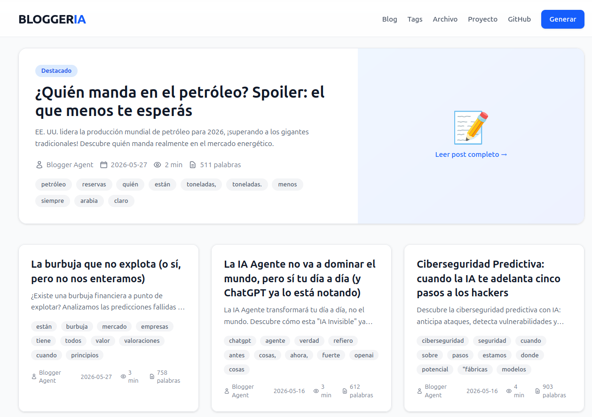
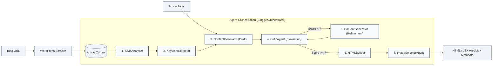

# BloggerIA

> Multi-agent artificial intelligence system designed for stylistic blog emulation, featuring interactive workflow visualization (Daggr). Built on a modern architecture based on Next.js, Modal and Supabase.

<p align="center">
  
</p>

*Multi-agent AI system that analyzes a blogger's style, generates new articles that faithfully mimic it and publishes them end to end.*

<p align="center">
  <a href="https://blogger-agent-tfg.vercel.app"><strong>Live Demo — blogger-agent-tfg.vercel.app</strong></a>
</p>

<div align="center">
  <a href="LICENSE"></a>
  <a href="https://github.com/AlejandroRS21/blogger-agent-tfg"></a>
  <a href="https://blogger-agent-tfg.vercel.app"></a>
  <a href="https://nextjs.org"></a>
  <a href="https://react.dev"></a>
  <a href="https://www.typescriptlang.org"></a>
  <a href="https://www.python.org"></a>
  <a href="https://tailwindcss.com"></a>
  <a href="https://supabase.com"></a>
  <a href="https://modal.com"></a>
  <a href="https://huggingface.co"></a>
</div>

---

## Table of Contents

- [Table of Contents](#table-of-contents)
- [System Architecture and Deployment](#system-architecture-and-deployment)
  - [Generation and Publishing Flow](#generation-and-publishing-flow)
- [Project Description](#project-description)
- [System Architecture](#system-architecture)
- [Quick Start](#quick-start)
  - [Backend — Full Orchestrator](#backend-full-orchestrator)
  - [Interactive Visual Interface with Daggr (Recommended)](#interactive-visual-interface-with-daggr-recommended)
  - [Simplified Pipeline](#simplified-pipeline)
  - [Frontend — Next.js 16](#frontend-nextjs-16)
  - [Vercel Deployment](#vercel-deployment)
  - [Test Suite](#test-suite)
- [Workflow (7 Phases)](#workflow-7-phases)
  - [Process Diagram (Agent Pipeline)](#process-diagram-agent-pipeline)
- [Modal Platform Integration](#modal-platform-integration)
- [Project Status](#project-status)
  - [Completed Milestones](#completed-milestones)
  - [Pending Tasks](#pending-tasks)
- [Technical Documentation](#technical-documentation)
- [Technologies Used](#technologies-used)
  - [Backend](#backend)
  - [Frontend](#frontend)
  - [DevOps & Cloud](#devops-cloud)
- [Documentation Consistency](#documentation-consistency)
- [License](#license)
- [Academic Context](#academic-context)

---

## System Architecture and Deployment

The application ecosystem is composed of three main components, deployed as follows:

1. **Frontend (Next.js 16)**: Deployed on **Vercel**. It consumes and exposes articles, retrieving them in real time dynamically from the database.
2. **Backend (Agent Orchestrator)**: Hosted on **Modal** as a serverless function infrastructure. It processes on-demand article generation through webhooks.
3. **Database (Supabase)**: Postgres database that acts as the central persistence store for every article generated by the agents.

### Generation and Publishing Flow

1. **User request**: From the Next.js web interface (Vercel), the user requests the generation of a new article by defining the topic and the reference blogger's URL.
2. **Webhook invocation**: The Next.js application invokes the serverless webhook exposed by the Modal backend.
3. **Pipeline execution**: Modal runs the multi-agent orchestrator (7 phases) to extract the style, structure the draft, apply critique/refinement and select visual assets.
4. **Automatic persistence**: Once generation completes, the Modal backend saves the formatted article directly into the Supabase database.
5. **Dynamic update**: The Next.js frontend performs dynamic queries (no cache) against Supabase to immediately show the new publication in the feed.

---

## Project Description

This multi-agent system has been designed to analyze in detail the writing style of an author (blogger) and generate new educational articles that faithfully mimic their voice. The architecture and agent flow of this development are inspired by the [Aphra](https://github.com/DavidLMS/aphra) project.

The backend uses **HuggingFace** as the main language model provider (free tier), **Modal** for serverless infrastructure with GPU support, and **Daggr** for interactive visualization of the agent workflow. The frontend is built with **Next.js 16**, React 19, TypeScript and Tailwind CSS 4, persisting every article centrally in **Supabase**.

## System Architecture

```
blogger-agent-tfg/
├── backend/                         # Python + Orchestrator + Daggr
│   ├── aphra_blogger/
│   │   ├── llm/                     # Multi-provider LLM abstraction
│   │   │   ├── base.py              # Abstract classes
│   │   │   ├── factory.py           # Factory with auto-fallback chain
│   │   │   ├── openrouter_provider.py   # OpenRouter (primary: Nemotron, free)
│   │   │   ├── gemini_provider.py       # Gemini (fallback)
│   │   │   ├── fallback_provider.py     # Fallback chain with backoff
│   │   │   ├── json_utils.py            # Robust JSON extraction
│   │   │   ├── huggingface_provider.py  # HuggingFace (legacy)
│   │   │   ├── openai_provider.py       # OpenAI (legacy)
│   │   │   └── modal_provider.py        # Modal with GPU (legacy)
│   │   ├── agents/                  # Specialized agents
│   │   │   ├── style_analyzer.py        # Style analysis
│   │   │   ├── keyword_extractor.py     # Keyword extraction
│   │   │   ├── content_generator.py     # Generation and refinement
│   │   │   ├── critic.py                # Critique and evaluation
│   │   │   ├── image_selector.py        # Image selection
│   │   │   ├── html_builder.py          # Markdown → HTML/JSX
│   │   │   ├── anonymous_blogger.py     # Anonymous blogger emulation
│   │   │   └── style_extractor.py       # Legacy style extraction
│   │   ├── workflows/
│   │   │   └── blogger_style.py
│   │   ├── config/
│   │   │   └── default.toml
│   │   └── context.py
│   ├── src/
│   │   └── orchestrator/            # Orchestration system
│   │       ├── main.py              # Orchestrator (7 phases)
│   │       ├── config.py
│   │       ├── state.py
│   │       └── runner.py            # CLI
│   ├── tools/
│   │   ├── scraper.py               # WordPress web scraper
│   │   └── style_analysis.py        # Morphological style adherence analysis
│   ├── tests/                       # ~384 tests
│   │   ├── test_agents.py
│   │   ├── test_orchestrator.py
│   │   ├── test_html_builder.py
│   │   ├── test_scraper.py
│   │   ├── test_workflow.py
│   │   ├── test_anonymous_blogger.py
│   │   ├── test_fallback_provider.py
│   │   ├── test_json_utils.py
│   │   ├── test_drain_recovery.py
│   │   └── test_unsplash.py
│   ├── daggr_blogger_workflow.py    # Visual workflow with Daggr
│   ├── modal_app.py                 # Modal deployment (serverless)
│   ├── llm_modal_host.py            # Self-hosted LLM on Modal GPU
│   ├── generate_and_deploy.py       # Simplified pipeline
│   ├── outputs/                     # Generated posts (JSON)
│   ├── requirements.txt
│   ├── pyproject.toml
│   ├── DAGGR_WORKFLOW.md
│   └── setup.sh / setup.ps1
├── frontend/                         # Next.js 16 + React 19 + Tailwind 4
│   ├── app/
│   │   ├── layout.tsx                # Root layout
│   │   ├── page.tsx                  # Homepage
│   │   ├── globals.css
│   │   ├── generate/page.tsx         # Generation form
│   │   ├── posts/[slug]/page.tsx     # Single post view
│   │   └── api/generate-post/route.ts # API endpoint (mock/real)
│   ├── components/
│   │   ├── Header.tsx
│   │   ├── Footer.tsx
│   │   ├── GenerateForm.tsx          # Client component
│   │   ├── PostCard.tsx
│   │   └── PostContent.tsx
│   ├── types/post.ts
│   ├── lib/api.ts
│   ├── package.json
│   └── README.md
├── docs/                            # (Legacy) Previous static website
├── project_docs/                    # Technical documentation
│   ├── ORCHESTRATION_PLAN.md
│   ├── MODAL_DEPLOYMENT.md
│   ├── HUGGINGFACE_MIGRATION.md
│   ├── FRONTEND_IMPLEMENTATION.md   # Historical: removed frontend
│   └── ...
├── LICENSE                          # MIT
└── ...
```

---

## Quick Start

### Backend — Full Orchestrator

```bash
# 1. Clone the repository
git clone https://github.com/AlejandroRS21/blogger-agent-tfg.git
cd blogger-agent-tfg/backend

# 2. Automated setup with the UV manager
./setup.sh   # Linux/macOS
# or
.\setup.ps1  # Windows

# 3. Configure the API keys (free)
export OPENROUTER_API_KEY="sk-or-..."    # OpenRouter (primary: Nemotron, free)
export GEMINI_API_KEY="..."              # Gemini (fallback, free with quota limits)
# Alternative providers (legacy):
export HF_TOKEN="hf_..."                 # HuggingFace
export OPENAI_API_KEY="sk-..."           # OpenAI (paid, contingency/fallback)

# 4. Run the orchestrator (7-phase process)
python -m src.orchestrator.runner \
  --topic "Best practices for building REST APIs with Python" \
  --blog-url "https://javipas.com" \
  --output "post.json"
```

### Interactive Visual Interface with Daggr (Recommended)

```bash
cd backend
python daggr_blogger_workflow.py
# Open http://localhost:7860
```

**Daggr features:**
- **Workflow visualization**: Interactive canvas showing connections between agents.
- **Node inspection**: Examine in detail the input and output of each agent.
- **Selective re-execution**: Run only the required nodes.
- **Visual debugging**: Easily identify errors in each stage of the process.
- **Persistence**: Keeps the workflow state across different sessions.

### Simplified Pipeline

```bash
cd backend
python generate_and_deploy.py "The future of AI in 2026"
```

### Frontend — Next.js 16

```bash
cd frontend
npm install
npm run dev
# Open http://localhost:3000
```

**Mock mode** (default): Works autonomously without a backend, providing sample data.
**Real mode**: Requires setting the variables `USE_MOCK=false` and the `BACKEND_URL` in the `frontend/.env.local` file.

#### Vercel Deployment

1. Import the repository in [vercel.com](https://vercel.com)
2. **Root Directory**: `frontend`
3. **Environment variables**: `USE_MOCK=true` (or `false` with `BACKEND_URL` if Modal infrastructure is available)
4. Deploy: Vercel will auto-detect the Next.js structure.

```bash
# Or via the command line interface (CLI)
cd frontend && npx vercel --prod
```

### Test Suite

```bash
cd backend
# Run the full test suite (about 384 tests)
pytest tests/ -v

# Component-specific tests
pytest tests/test_orchestrator.py -v
pytest tests/test_html_builder.py -v
pytest tests/test_agents.py -v
pytest tests/test_fallback_provider.py -v
pytest tests/test_json_utils.py -v
pytest tests/test_drain_recovery.py -v
pytest tests/test_unsplash.py -v

# End-to-end integration test (E2E)
python test_full_pipeline.py
```

---

## Workflow (7 Phases)

### Process Diagram (Agent Pipeline)



1. **Style analysis** (`style_analyzer`): Examines the author's previous publications to extract formal metrics.
2. **Keyword extraction** (`keyword_extractor`): Identifies the recurring terms and semantic keywords.
3. **Content generation** (`content_generator`): Writes an initial draft aligned with the analyzed style.
4. **Critical evaluation** (`critic`): Evaluates coherence and stylistic fidelity, assigning a score from 0 to 10.
5. **Refinement** (`content_generator`): Applies improvements based on the critical report if the score is below 7.
6. **HTML building** (`html_builder`): Converts the Markdown draft into optimised HTML and JSX structures.
   - Generates semantic HTML with metadata tags optimized for SEO.
   - Generates JSX components compatible with React and Next.js.
   - Includes a dynamic index or table of contents (TOC).
   - Calculates the estimated reading time and word count.
7. **Visual asset selection** (`image_selector`): Generates image descriptions (*prompts*) and indicates their optimal location in the article.

---

## Modal Platform Integration

The **Modal** platform is used to enable serverless deployments with GPU support:

- **`modal_app.py`**: Deploys the orchestrator module as a serverless *webhook*.
- **`llm_modal_host.py`**: Hosts the Qwen 2.5 7B model on an A10G GPU for local inference.

```bash
# Deploy the orchestrator on the serverless infrastructure
modal deploy backend/modal_app.py

# Deploy the self-hosted language model (LLM) configured with GPU
modal deploy backend/llm_modal_host.py
```

---

## Project Status

### Completed Milestones
- **LLM abstraction**: Multi-provider support with **automatic fallback chain** (OpenRouter Nemotron → Gemini → legacy providers).
- **Primary model — OpenRouter Nemotron (`nvidia/nemotron-3-ultra-550b-a55b:free`)**: free tier, best Spanish prose quality (benchmarked vs Gemini, Nemotron 120B, Gemma, GPT-OSS).
- **Fallback resilience**: automatic retry with backoff on 429/timeout/empty output; robust JSON extraction (`json_utils`) tolerant to code fences and prose.
- **Agent architecture**: Full implementation of StyleAnalyzer, KeywordExtractor, ContentGenerator, Critic, ImageSelector, HTMLBuilder and AnonymousBloggerEmulator.
- **Orchestrator**: 7-phase flow with retry management, logging and state control.
- **Scraper**: Optimized for WordPress sites (fully compatible with javipas.com).
- **Test suite**: about 384 unit and integration tests (fallback chain, JSON extraction, drain recovery, Unsplash dedupe).
- **Job queue reliability**: drain process recovers jobs lost between queue.get and spawn (stale-running requeue with full payload persistence).
- **Image selection**: Unsplash dedupe within batch + pseudo-random selection (was always returning the first result → repeated images).
- **Morphological style analysis**: `style_analysis.py` scores generated articles against the assigned author profile (spaCy features + vocabulary overlap), mean 84/100 across 21 test articles.
- **Daggr**: interactive and visual workflow interface built with Gradio.
- **Next.js frontend**: using App Router, React 19, TypeScript and Tailwind CSS 4.
- **Persistence and DB**: direct connection and insertion of publications into Supabase (with `status`/`error_message` columns for job tracking).
- **Modal**: ready for serverless deployment of the backend components.

### Pending Tasks
- **CI/CD**: GitHub Actions configuration to run tests and automatic deployment.
- **End-to-end tests (E2E)**: cypress or Playwright implementation to validate the Next.js web application.
- **Modal environment tests**: validation of the real deployment in production.
- **Image regeneration**: re-run image selection on existing posts to benefit from the dedupe/variety fix.
- **PII false positives**: refine the moderator's credit-card detection (currently flags innocent digit sequences).

---

## Technical Documentation

- [Orchestration Plan](project_docs/ORCHESTRATION_PLAN.md): conceptual and development plan of the orchestrator.
- [Next Steps](project_docs/NEXT_STEPS.md): roadmap and planning of future tasks.
- [Project Status](PROJECT_STATUS.md): consolidated summary of the project status and history.
- [Modal Deployment](project_docs/MODAL_DEPLOYMENT.md): deployment guide for the backend services.
- [HuggingFace Migration](project_docs/HUGGINGFACE_MIGRATION.md): documentation about the HuggingFace API integration.
- [HTMLBuilder Integration](project_docs/HTMLBUILDER_INTEGRATION.md): guide of the HTMLBuilder converter module.
- [Frontend Implementation](project_docs/FRONTEND_IMPLEMENTATION.md): historical record of the previous frontend version.
- [Frontend README](frontend/README.md): documentation of the Next.js frontend.
- [Daggr Workflow](backend/DAGGR_WORKFLOW.md): usage guide of the integrated graphical interface.
- [Agents Guide](backend/AGENTS_GUIDE.md): development guide and behavior guidance for AI agents.
- [Completion Summary](project_docs/RESUMEN_TRABAJO_COMPLETADO.md): consolidated history of the work carried out.

---

## Technologies Used

### Backend
- Python 3.11+
- **OpenRouter (Nemotron 550B free)** — primary LLM, best Spanish prose
- **Google Gemini** — automatic fallback when OpenRouter hits rate limits
- **Fallback chain** — automatic retry with backoff across providers
- HuggingFace Inference API / OpenAI — legacy providers
- **Modal** — serverless deployment with GPU (A10G)
- **Daggr + Gradio** — interactive visual workflow with agents
- **python-markdown + Pygments** — Markdown → HTML
- **beautifulsoup4 + lxml** — WordPress blog web scraping
- **spaCy** — morphological style analysis (`style_analysis.py`)
- **pytest** — about 384 tests

### Frontend
- **Next.js 16.1** (App Router)
- **React 19**
- **TypeScript 5**
- **Tailwind CSS 4**
- Mock mode support for API-decoupled development
- **Supabase Client SDK** — database queries and interaction

### DevOps & Cloud
- **Vercel** — Next.js frontend deployment
- **Modal** — serverless hosting for the agent backend
- **Supabase** — Postgres database and relational engine

---

## Documentation Consistency

This document reflects the current state of the project as of August 2026.

> **Note**: The original frontend built with Next.js was discarded in February 2026. In May 2026 a complete rebuild was carried out using Next.js 16, React 19 and Tailwind CSS 4. The primary development specs are preserved in `project_docs/FRONTEND_IMPLEMENTATION.md` for historical reference.

---

## License

MIT License — See [LICENSE](LICENSE) for more details.

---

## Academic Context

Final Degree Project (TFG) — Specialization in Artificial Intelligence and Big Data  
Rafael Alberti High School (IES Rafael Alberti) — 2026 call.
